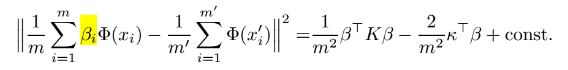
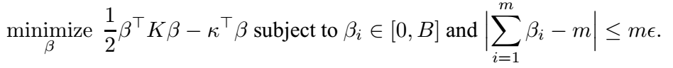

# Traditional Transfer Learning

  This is an demo for Traditional transfer learning techniques.
## Instance-weighting methods

## 1. TrAdaboost. 
Ref. *Boosting for Transfer Learning,* ICML 2007. 
     [Demo](./TrAdbMultiClass.py) 
     
      
## 2. Regression Tradaboost. 
   [Demo](./TrAdaBoostRegression.py)  
  In the classification case, the weights are multiplied with `coef.^(0 or 1).`  
  While in the regression Tradaboost, the abs error is used as the power term. 

## 3. Instance weighting kernel ridge regression
Instance-weighted kernel ridge regression 
     [Code](./IW_KRR.py), [Demo](./IWKRR_Demo.py)   
Ref: *Jochen Garcke, Importance Weighted Inductive Transfer Learning for Regression* 

In this scenario, the source domain data are all labeled, and a small portion from the target domain is labeled too. Here we call this part “Auxiliary data”. The rest of the target domain data is unlabeled and called “Test data”. 
In this method, the weights (alphas) of source instances are calculated based on \[source data + auxiliary data] and applied on the source instances.  
The source set has n instances and auxiliary set has m.  
The method contains 3 steps: 
1)	A kernel ridge regression (rbf kernel) model is trained and test on the Source data. The dual ecoefficiency a (n*1) is obtained.  
2)	This a is used to calculate the weights alphas. Instead of scalars applied on each of the instances, here the author uses a form of rbf distances:  
  
And *alpha* is the variable, instead of ***w***(x,y) 
And the cost function is weighted error with a regulating term on *alpha*.  
  
*Alpha* is supposed to be >0, therefore a library of convex optimize, a function like quadprog in Matlab is used here.  
In this step, the sample weights of the source data are obtained from \[X_source, X_auxiliary, Y_source, and Y_auxiliary].  
3)	Then a weighted kernel ridge regression is performed. The weights of Source data are normalized to \[0,1], and the weights for Auxiliary data are all 1. Test data are predicted using this model.   
This model has 5 hyper parameters: the sigma for the rbf kernel; the lambda in the 1st ridge regression; the eta in the weight-alpha relationship; the gamma in the 2nd step for regularizing the alpha; and the lambda in the 3rd step. 

## 4. Kernel mean matching (KMM)
   [Code](./KMM.py), [Demo](./Kmm_Demo.py)    
*Ref: Jiayuan Huang; Correcting Sample Selection Bias by Unlabeled Data  
Corinna Cortes; Domain Adaptation and Sample Bias Correction Theory and Algorithm for Regression *
Prerequisite: cvxopt 

KMM works by assigning weights to Source data samples, such that the distribution discrepancy between Source and Target is minimized.  
<b> How is the discrepancy represented and minimized?</b> 
The distribution discrepancy is evaluated by MDD. i.e. minimizing the distance of mean embedding of each dimension: 
  
With regarding to the ***β***. With constrains.  
This distance is a quadratic term. After expanding, *Φ(X_source) Φ(X_source)* is kernel ***K***,  *Φ(X_source) Φ (X_target)* is kernel ***κ***.  
So this problem is represented as: 
  
Where the B is the Bound, limiting the *“scope of discrepancy”* between two X sets. In other words it limits the upper bound of each weight value. And the ε *“ensures that the measure ***β (x)Pr(x)*** is close to a probability distribution”*. (The integrated discrepancy?) 
and it is a quad problem can be solved with optimizer e.g. quadprog().  

## Subspace matching methods
## 5. Subspace Alignment (SA)
[Matlab](./SA.m) 
*Ref. Fernando, Basura, et al. "Unsupervised visual domain adaptation using subspace alignment." Proceedings of the IEEE international conference on computer vision. 2013.*  
Assumption: Source and Target should have same principle components. (The first several principle components should have the same directions.) 
Optimization: (Data is first standardized). The principle bases are extracted from PCA. Named Xs, Xt here. (Note that the Xs Xt are not data matrixes but the principle components axis.)  
After a linear transformation M, *dist( XsM, Xt )* is minimized. The optimization problem is  
min *F(M) = ||XsM-Xt||^2 Fro*.
Because the Frobenius norm is invariant to orthonormal operations,  
F(M)=‖X_s^T X_s M-X_s^T X_T ‖_F^2=‖M-X_s^T X_T ‖_F^2. 
Thus M=X_s^T X_T  
Xs  * Xs’ * Xt is the transformed Source principle components.  

## 6. Subspace distribution alignment. (SDA)
[Matlab](./SDA_demo.m) 
ref: 
Assumption: Source and Target should have same principle components. And the distributions in the principle component subspaces should also be the same.  
In the SA, both Source and Target are projected to the PCs of Target, and the principle components of Source and Target are matched. However, the distributions can be different.  
SDA matches the variances of the projected data.  
The PCs of source are orthogonal, so the eigenvalues form a diagonal matrix. Beside the transform of PC directions, SDA also includes a term balancing the scale of PC projection.  
Suppose Es and Et are the eigenvalues corresponding to Ss and St. Then we could set Ws = E1/2s and Wt = E1/2t as Es and Et are the variances of the orthogonal principal components. Thus, we assign  
AT S = Ws-1Wt = E-1/2s * E1/2t. (Whitening the PCs of Source first and recolor the PC variance with the Target). 
Code: 
[Xss,~,Ess] = pca(Xs); 
[Xtt,~,Ett] = pca(Xt); % the E is Principal component variances; already sorted 
Ms = PCs * (PCs'*PCt) * diag((PEs.^-0.5 .* PEt.^0.5)) ; 
Mt = PCt; 
% 
newS = Xs * Ms; 
newT = Xt * Mt; 
 
Experiment: 
1)	Generate data: 
Xs = mvnrnd([1 3],[1 0; 0 1],600);
Xt = mvnrnd([4 1],[10 -5; -5 5],400);
Xs = zscore(Xs);
Xt = zscore(Xt);

2)	Matching.

3)	Std of Xs, Xt projected to their PCs:  
Source: 1.0030    0.9970, Target: 1.3207    0.5057

Std after matching:  
Source: 1.3128    0.5087, Target: 1.3207    0.5057

## 7. Correlation alignment. (CORAL)
[Matlab](./Coral.m) 
  The assumption is in different tasks, the correlation between features should be similar. e.g. A hat should always have high correlation to the head.  
  (Does that means CORAL is more efficient in top layers?) 
  The correlation descrepancy between mapped source data and the target data is minimized.
  
## A very important distance metric, MDD
Ref. *Sinno Jialin Pan; Transfer Learning via Dimensionality Reduction,* AAAI 2008. 
**nonparametric estimate criterion** 
By definition, MDD is the max distance in all the mapped spaces. Dist is zero *iff.* P = Q.  
The empirical estimate of distance between P and Q defined by MMD is as follows:.... where H is a universal RKHS . 
the distance between distributions of two samples is equivalent to the distance between the means of the two samples mapped into a RKHS.

 distance between distributions of two samples is equivalent to the distance between the means of the two samples mapped into a RKHS.
